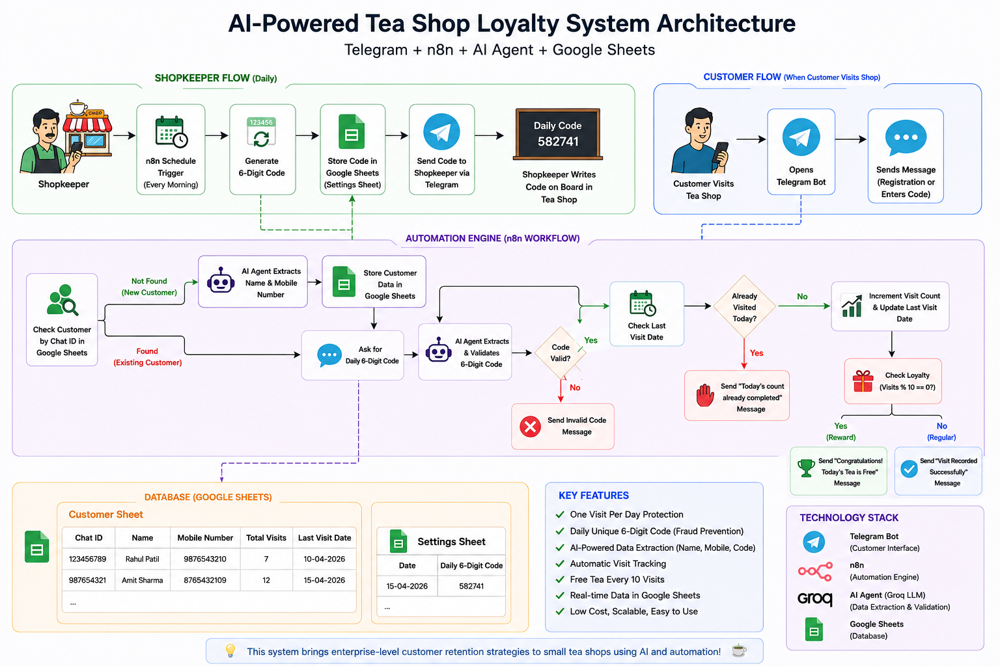
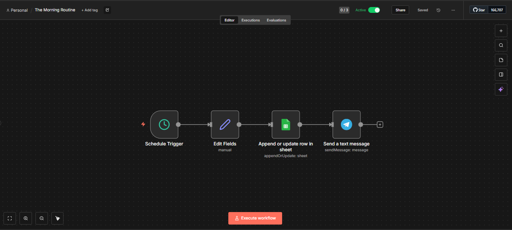
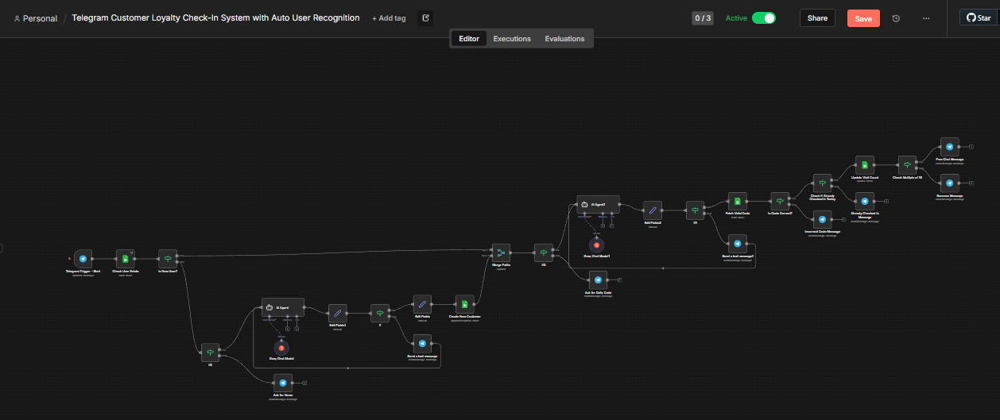
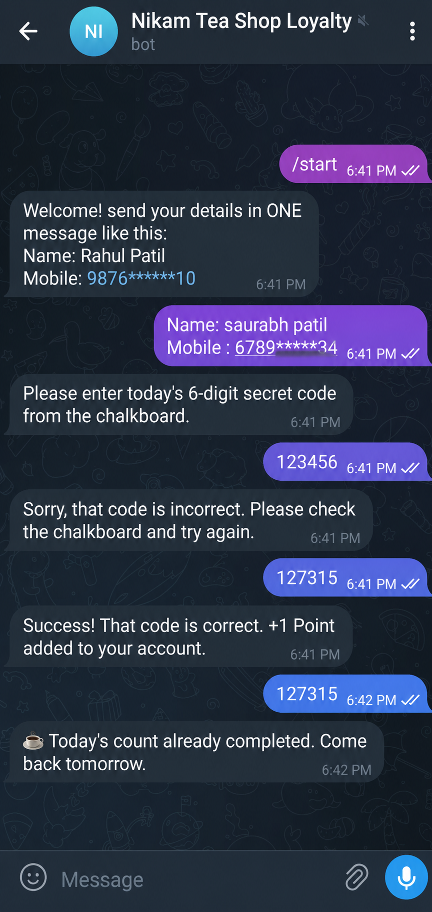
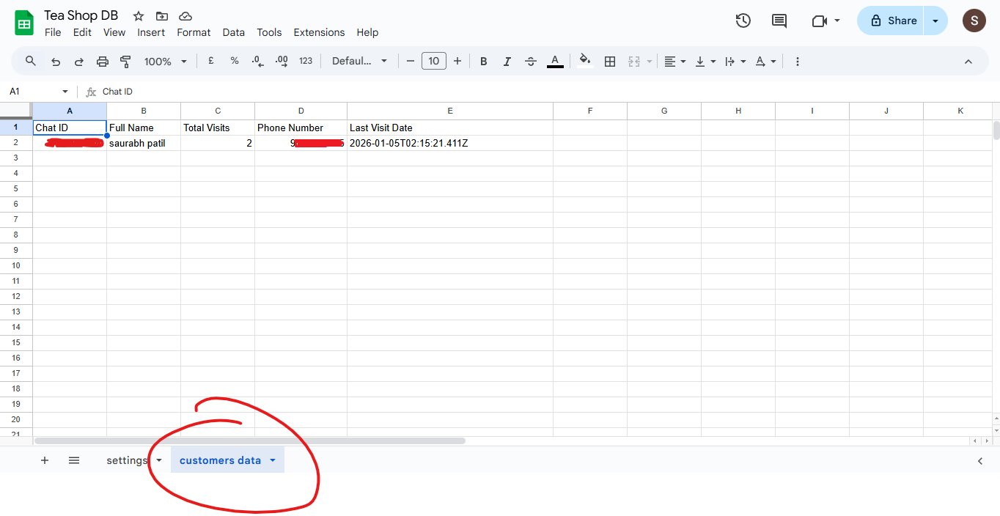
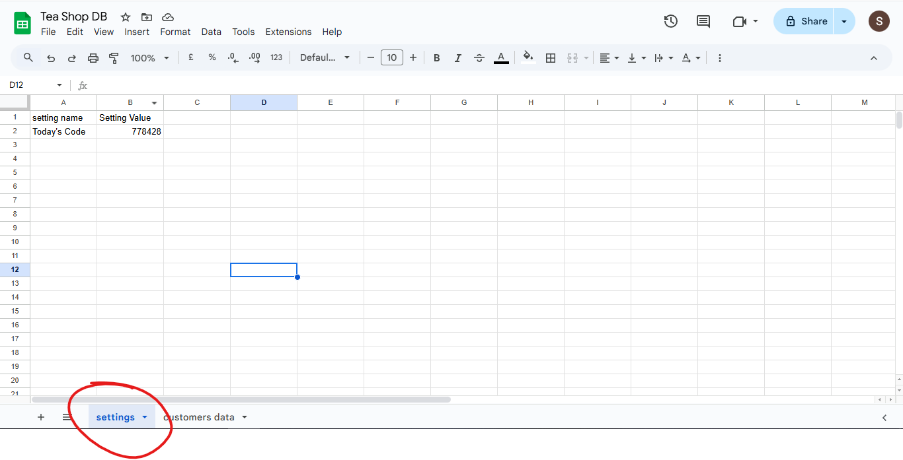

# ☕ AI-Powered Tea Shop Loyalty System

### 🚀 An AI-powered customer loyalty system inspired by Duolingo-style engagement, helping local tea shops increase repeat customer visits using Telegram, AI Agents, and workflow automation.

<p align="center">


</p>

---

## 📑 Table of Contents

- [🚀 Overview](#-overview)
- [🏗️ System Architecture](#️-system-architecture)
- [🎥 Project Demo](#-project-demo)
- [📖 Problem Statement](#-problem-statement)
- [💡 Solution](#-solution)
- [⚙️ How It Works](#️-how-it-works)
- [🛠️ Technology Stack](#️-technology-stack)
- [✨ Features](#-features)
- [📸 Screenshots & Demo](#-screenshots--demo)
- [🧠 Challenges & Lessons Learned](#-challenges--lessons-learned)
- [📁 Repository Structure](#-repository-structure)
- [🔒 Security Notice](#-security-notice)
- [👨‍💻 Author](#-author)
- [📜 License](#-license)

---

## 🚀 Overview

This project is an **AI-powered customer loyalty automation system** designed for small tea shops to increase repeat customer visits through a simple Telegram-based experience.

Instead of requiring a dedicated mobile application or expensive CRM software, customers interact with a Telegram bot to register, verify their daily visit using a unique 6-digit code, and automatically earn rewards after every 10 successful visits.

The system combines **AI Agents**, **workflow automation**, and **Google Sheets** to deliver an affordable loyalty solution that local businesses can adopt with minimal setup.

---

## 🎯 Inspired By

Inspired by customer engagement systems used by:

- 🦉 Duolingo Streaks
- 💼 LinkedIn Daily Games
- ☕ Starbucks Rewards
- 🛍️ Myntra Reward Campaigns

The goal is to bring similar engagement mechanics to small local businesses using AI and automation.

---

> **Enterprise-level customer retention strategies for small local businesses using AI automation.**


## 🏗️ System Architecture

<p align="center">
  
</p>


---

> 💡 **Business Value**
>
> This AI-powered loyalty system helps local tea shops increase repeat customer visits, automate customer management, and reward loyal customers without requiring a custom mobile app or expensive CRM software.


---


# 🎥 Project Demo

Want to see the system in action?

▶️ **Watch the complete project demo on LinkedIn:**

🔗 **Demo Video:** https://www.linkedin.com/feed/update/urn:li:activity:7472657993977765892/

📖 **Detailed Blog:** https://rb.gy/g3qdb0

The demo showcases:

- Customer Registration
- AI-powered Name & Mobile Extraction
- Daily 6-Digit Code Validation
- One Visit Per Day Protection
- Google Sheets Database Update
- Complete End-to-End Workflow


---


# 📖 Problem Statement

Small tea shops often rely on repeat customers, but they usually have **no simple way to encourage customers to return regularly**.

Traditional loyalty programs like paper punch cards or mobile applications are often expensive, difficult to maintain, or inconvenient for both customers and shop owners.

As a result:

- Customers visit once and may not return for days or weeks.
- Shop owners cannot track customer visits.
- There is no customer database.
- There is no automated reward system.
- Customer retention depends entirely on memory.

Large companies solve this problem using sophisticated loyalty platforms, but these solutions are usually too expensive for small local businesses.

This project aims to bridge that gap.

---

# 💡 Solution

I built an **AI-powered customer loyalty system** that allows a tea shop owner to manage customer retention using only:

- Telegram Bot
- n8n Workflow Automation
- AI Agents (Groq)
- Google Sheets

Customers simply chat with the Telegram bot.

The AI Agent understands natural language, registers customers automatically, validates daily visit codes, tracks customer visits, prevents duplicate check-ins, and rewards loyal customers after every 10 successful visits.

No mobile application.

No custom backend.

No expensive CRM.

Just affordable automation powered by AI.

---

# 🌟 Key Highlights

- 🤖 AI-powered customer registration
- ☕ Daily visit tracking
- 🔐 Fraud prevention using unique daily verification codes
- 📊 Automatic customer database
- 📅 One visit allowed per customer per day
- 🎁 Free tea reward after every 10 successful visits
- ⚡ Fully automated using n8n workflows
- 💬 Simple Telegram-based customer experience

---

# 🎯 Business Impact

This solution helps local tea shops:

- Increase repeat customer visits
- Build long-term customer loyalty
- Reduce manual record keeping
- Create a digital customer database
- Improve customer engagement
- Deliver rewards automatically
- Adopt enterprise-style retention strategies at almost zero operational cost

Instead of investing in expensive software, a small business can run the entire loyalty system using free or low-cost tools.


---

# ⚙️ How It Works

The system is divided into two independent workflows:

## 🌅 Workflow 1 — Daily Code Generation

Every morning at **7:00 AM**, the automation runs automatically.

1. n8n Schedule Trigger starts the workflow.
2. A random 6-digit verification code is generated.
3. The code is stored in the **Settings** Google Sheet.
4. The same code is automatically sent to the shopkeeper through Telegram.
5. The shopkeeper displays the code inside the tea shop.

This ensures that only customers physically visiting the shop can record their visit.

---

## 👤 Workflow 2 — Customer Loyalty Flow

When a customer interacts with the Telegram bot, the following process occurs:

### Step 1 — Customer Verification

The system checks whether the customer's Telegram Chat ID already exists in the Google Sheet.

**If the customer is new:**

- The bot requests the customer's Name and Mobile Number.
- An AI Agent extracts the information from natural language.
- Customer details are stored in Google Sheets.
- The customer is asked to enter today's 6-digit verification code.

**If the customer already exists:**

- Registration is skipped.
- The bot directly asks for today's verification code.

---

### Step 2 — Daily Code Validation

The customer enters the 6-digit code displayed inside the tea shop.

The AI Agent extracts the code from the customer's message and compares it with today's generated code.

If the code is incorrect:

❌ The visit is rejected.

If the code is correct:

✅ The workflow continues.

---

### Step 3 — Daily Visit Protection

Before increasing the visit count, the system checks the customer's **Last Visit Date**.

If the customer has already checked in today:

❌ The visit is rejected.

The bot sends:

> "Today's count is already completed. Please visit again tomorrow."

Otherwise:

✅ The visit is accepted.

---

### Step 4 — Loyalty Update

The automation:

- Increases **Total Visits** by 1.
- Updates the **Last Visit Date**.
- Saves the updated information in Google Sheets.

---

### Step 5 — Reward System

After updating the visit count, the system checks:

```
Total Visits % 10 == 0
```

If TRUE:

🎉 The customer receives a message:

> "Congratulations! Today's Tea is FREE! ☕"

Otherwise:

The customer receives a normal success message confirming today's visit.

---

## 🔄 Complete Workflow

```text
Customer
      │
      ▼
Telegram Bot
      │
      ▼
Check Customer
      │
 ┌────┴────┐
 │         │
New      Existing
 │         │
 ▼         ▼
Register  Enter Code
 │         │
 └────┬────┘
      ▼
AI Validation
      ▼
Code Verification
      ▼
Already Visited Today?
      │
 ┌────┴────┐
 │         │
No        Yes
 │         │
 ▼         ▼
Increase   Show
Count      Already Counted
 │
 ▼
Reward Check
 │
 ▼
Free Tea Every 10 Visits
```


---

# 🛠️ Technology Stack

| Category | Technology | Purpose |
|----------|------------|----------|
| 🤖 AI Model | Groq LLM | Extract customer details and validate daily verification codes from natural language |
| ⚙️ Workflow Automation | n8n | Automates the complete customer loyalty workflow |
| 💬 Customer Interface | Telegram Bot | Customer registration and daily interaction |
| 🗄️ Database | Google Sheets | Stores customer records and daily verification code |
| 🔍 Data Processing | AI Agent + IF Logic | Customer validation, code verification, and reward logic |
| 🔑 Verification | Daily 6-Digit Code | Prevents fake or remote check-ins |
| 🎁 Loyalty System | Visit-Based Reward Engine | Free tea after every 10 successful visits |
| Version Control | Git & GitHub | Source code management |

---

## 💻 Core Technologies

- **n8n**
- **Telegram Bot API**
- **Groq LLM**
- **Google Sheets API**
- **AI Agents**
- **Prompt Engineering**
- **Workflow Automation**
- **Business Process Automation**
- **Natural Language Processing (NLP)**

---

## 🏗️ System Components

### Customer Side
- Telegram Bot
- Natural Language Input
- Daily Code Verification

### Automation Layer
- n8n Workflow
- AI Agent
- Business Logic
- Reward Engine

### Data Layer
- Google Sheets (Customer Database)
- Google Sheets (Daily Settings)

### Shopkeeper Side
- Automatic Daily Code Notification
- Manual Code Display in Shop

---

## 🔒 Security & Validation

The system includes multiple validation layers to prevent misuse.

- ✅ Chat ID-based customer identification
- ✅ AI-powered data extraction
- ✅ Daily unique verification code
- ✅ One visit allowed per day
- ✅ Automatic reward validation
- ✅ Customer database management


---

# ✨ Features

## 🤖 AI-Powered Customer Registration

Customers don't need to fill out forms or follow rigid commands.

They simply send their details in natural language, for example:

> "My name is Rahul Patil and my mobile number is 9876543210."

The AI Agent automatically extracts:

- Name
- Mobile Number

and stores them in the customer database.

---

## ☕ Daily Visit Verification

Every morning, the system automatically generates a unique 6-digit verification code.

The shopkeeper receives the code through Telegram and displays it inside the tea shop.

Customers must enter the correct code to record their visit.

This ensures that only customers physically visiting the shop can claim rewards.

---

## 🔐 Fraud Prevention

The system prevents fake check-ins using multiple validation layers.

- Unique daily verification code
- Telegram Chat ID verification
- AI-based code validation
- One successful visit per day

---

## 📅 One Visit Per Day Rule

Each customer can record only one successful visit per day.

If the same customer tries again on the same day, the bot responds:

> "Today's count is already completed. Please visit again tomorrow."

This prevents abuse of the reward system.

---

## 📊 Automatic Customer Database

The system automatically maintains a customer database containing:

- Customer Name
- Mobile Number
- Telegram Chat ID
- Total Visits
- Last Visit Date

No manual data entry is required.

---

## 🎁 Loyalty Reward System

Customers receive one free tea after every 10 successful visits.

Rewards are automatically triggered at:

- 10 Visits
- 20 Visits
- 30 Visits
- 40 Visits

and continue indefinitely.

---

## ⚡ Fully Automated Workflow

The complete customer journey is automated.

Morning:

- Generate verification code
- Store code
- Notify shopkeeper

Customer Visit:

- Registration (if required)
- Code validation
- Visit tracking
- Reward calculation
- Database update

No manual intervention is required.

---

## 📈 Business Benefits

This solution helps local tea shops:

- Increase repeat customer visits
- Build long-term customer loyalty
- Reduce manual record keeping
- Create a digital customer database
- Reward loyal customers automatically
- Improve customer engagement
- Adopt enterprise-level retention strategies at minimal cost

---

## 💡 Why This Project Matters

Large companies invest millions in customer retention platforms.

This project demonstrates that similar engagement and loyalty strategies can be implemented for small local businesses using affordable AI-powered automation.

It shows how AI Agents can solve real business problems beyond simple chatbots by combining automation, natural language understanding, and workflow orchestration.


---

# 📸 Screenshots & Demo

## 🏗️ System Architecture

The following architecture illustrates how the entire loyalty system works, including the interaction between customers, the shopkeeper, Telegram Bot, AI Agents, n8n workflows, and Google Sheets.

<p align="center">
  
</p>

---

## 🌅 Morning Automation Workflow

Every morning at 7:00 AM, n8n automatically generates a new 6-digit verification code, stores it in Google Sheets, and sends it to the shopkeeper via Telegram.

<p align="center">
  
</p>

---

## 🤖 Customer Loyalty Workflow

This workflow manages the complete customer journey, including registration, AI-powered data extraction, daily code validation, visit tracking, reward calculation, and database updates.

<p align="center">
  
</p>

---

## 💬 Telegram Bot

Customers interact with the system using a Telegram Bot to:

- Register with their Name and Mobile Number
- Enter the daily verification code
- Receive visit confirmations
- Earn loyalty rewards

<p align="center">
  
</p>

---

## 📊 Customer Database

Customer information is stored automatically after successful registration.

<p align="center">
  
</p>

---

## ⚙️ Daily Settings Database

The Settings Sheet stores the daily verification code generated by the morning automation workflow.

<p align="center">
  
</p>


---

# 🧠 Challenges & Lessons Learned

Building this project was more than connecting workflow nodes—it required solving real-world automation and business logic challenges.

Here are some of the most valuable lessons I learned during development.

---

## Challenge 1 — Managing Multi-Step Conversations

Initially, I tried to collect customer details using **Wait Nodes** after asking for the customer's name.

This approach became difficult because users could respond at any time, making conversation state management unreliable.

### Solution

Instead of relying on multiple Wait Nodes, I used an **AI Agent** to extract structured information directly from a single natural language message.

Example:

```
Input:
"My name is Rahul Patil and my mobile number is 9876543210"

Output:
{
  "name": "Rahul Patil",
  "mobile": "9876543210"
}
```

This made the workflow simpler, more reliable, and easier to maintain.

---

## Challenge 2 — Validating Daily Verification Codes

Customers could send messages in different formats.

Instead of checking only plain text, the AI Agent extracts the 6-digit verification code from natural language input before validation.

This provides a much better user experience and reduces input errors.

---

## Challenge 3 — Preventing Duplicate Daily Check-ins

One of the biggest business challenges was ensuring that customers could record **only one visit per day**.

### Solution

The workflow compares the customer's **Last Visit Date** with today's date.

If both dates match, the visit is rejected and the customer receives a message informing them that today's visit has already been recorded.

---

## Challenge 4 — Visit Count Management

The visit counter needed to increase only when:

- The customer entered the correct verification code.
- The customer had not already checked in on the same day.

Implementing this logic required careful validation to avoid duplicate or incorrect visit counts.

---

## Challenge 5 — Building Without a Traditional Backend

Instead of using databases such as MySQL or Firebase, the entire system uses **Google Sheets** as the backend database.

This demonstrates that AI-powered business automation can be built using affordable, low-code tools without sacrificing functionality.

---

# 📚 Key Learnings

Through this project, I gained practical experience in:

- Designing AI-powered workflow automation
- Building conversational AI using Telegram
- Prompt engineering for structured data extraction
- Business process automation with n8n
- Workflow debugging and optimization
- Customer loyalty system design
- Fraud prevention using validation logic
- Creating production-style automation for small businesses

---

# 🚀 Future Improvements

This project can be extended with several additional features:

- Web dashboard for shop owners
- QR code-based customer check-in
- WhatsApp integration
- Multi-store support
- Customer analytics dashboard
- Firebase or PostgreSQL database
- Digital coupons and rewards
- Admin dashboard
- Customer leaderboard
- Push notifications and promotional campaigns

The current implementation provides a strong foundation that can be expanded into a complete customer loyalty platform for local businesses.


---

# 📁 Repository Structure

```
AI-Powered-Tea-Shop-Loyalty-System/
│
├── README.md
├── LICENSE
│
├── assets/
│   ├── architecture.png
│   ├── workflow-customer.png
│   └── workflow-morning.png
│
├── screenshots/
│   ├── telegram-chat.png
│   ├── customer-sheet.png
│   └── settings-sheet.png
│
└── docs/
```

---

# 🔒 Security Notice

For security and privacy reasons, this repository **does not include**:

- n8n workflow JSON files
- Telegram Bot Token
- Groq API Key
- Google Sheets IDs
- n8n Credentials
- Environment Variables

Only the project architecture, documentation, screenshots, and implementation overview are shared.

---

# 📌 Project Status

> ✅ Project Completed

### Current Features

- AI-powered customer registration
- Telegram Bot interface
- Daily verification code generation
- One visit per day validation
- Automatic visit tracking
- Google Sheets database
- Reward after every 10 visits
- Fraud prevention
- AI-powered data extraction

---

# 🎯 Ideal Use Cases

This solution can be adapted for many local businesses, including:

- ☕ Tea Shops
- 🍽️ Restaurants
- 🥤 Cafés
- 🍕 Fast Food Outlets
- 🥛 Juice Centers
- 🛒 Grocery Stores
- 🏋️ Gyms
- 💇 Salons
- 🧺 Laundry Services
- 🛍️ Small Retail Shops

---

# 💭 Future Vision

The long-term vision is to transform this project into a reusable AI-powered loyalty platform that can be customized for different local businesses with minimal configuration.

Future versions may include:

- Multi-business support
- Admin Dashboard
- QR Code Check-in
- Customer Analytics
- WhatsApp Integration
- Firebase / PostgreSQL Database
- AI-powered Customer Insights
- Promotional Campaign Automation
- Dashboard for business owners to monitor customer engagement and loyalty statistics.

---

# 👨‍💻 Author

**Saurabh Patil**

MCA Student | AI Automation Enthusiast | n8n Developer

I enjoy building AI-powered automation solutions that solve real-world business problems for small and medium-sized businesses.

- 💼 LinkedIn: https://www.linkedin.com/in/saurabh-patil-65b387268
- ✍️ Blog: https://rb.gy/g3qdb0

---

# ⭐ Support

If you found this project interesting or useful:

⭐ Star this repository

💬 Share your feedback

🚀 Connect with me on LinkedIn

Your support motivates me to build more AI-powered automation projects.

---

## 📜 License

This project is licensed under the **MIT License**.

Feel free to use this project for learning.
